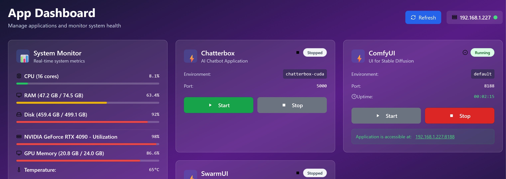

# NexRift

A modern web-based dashboard for managing Python applications running on a remote server. Start, stop, and monitor your applications with a beautiful, responsive interface.

## ✨ Features

- **🚀 Remote App Management** - Start and stop Python applications from anywhere
- **🎨 Modern Dashboard** - Beautiful, responsive web interface with real-time updates
- **🔧 Multiple App Types** - Support for conda environments, executables, and batch files
- **📊 Live Status** - Real-time app status, uptime tracking, and health monitoring
- **🖥️ Easy Setup** - One-click batch file launchers for Windows
- **🌐 Network Access** - Access your apps from any device on your network

## 📱 Screenshots



The dashboard provides:
- Real-time application status monitoring
- Start/Stop controls for each application
- Uptime tracking and last started timestamps
- Direct links to running applications
- Error handling and connection status

## 🛠️ Installation

### Prerequisites

- **Python 3.8+** installed on your system
- **Git** (optional, for cloning)
- **Windows** (batch files are Windows-specific, but the app works on any OS)

### Step 1: Clone or Download

```bash
git clone <repository-url>
cd python-app-manager
```

Or download and extract the files to your desired directory (e.g., `E:\projects\pythonappmanager`).

### Step 2: Create Virtual Environment

**Option A: Using Conda (Recommended)**
```bash
conda create -n app_manager_env python=3.9
conda activate app_manager_env
```

**Option B: Using Python venv**
```bash
python -m venv app_manager_env
app_manager_env\Scripts\activate  # Windows
source app_manager_env/bin/activate  # Linux/Mac
```

### Step 3: Install Dependencies

```bash
pip install Flask Flask-CORS psutil
```

### Step 4: Configure Your Applications

Edit the `app_configs` dictionary in `app_manager.py` to match your applications:

```python
app_configs = {
    'your_app': {
        'name': 'Your App Name',
        'environment': 'your-conda-env',  # or None
        'path': 'path/to/your/script.py',
        'port': 8000,
        'description': 'Your app description',
        'working_dir': 'path/to/working/directory',
        'type': 'conda'  # or 'executable', 'batch'
    }
}
```

### Step 5: Set Up Dashboard

Create a `dashboard` directory and set up the frontend:

```bash
mkdir dashboard
cd dashboard
python ../setup_dashboard.py  # This creates dashboard.html and serve_dashboard.py
```

## 🚀 Quick Start

### Option 1: Using Batch Files (Windows - Recommended)

1. **Download the batch files** from the artifacts and save them:
   - `start_all.bat` → Save to your Desktop
   - `start_app_manager.bat` → Save to project directory
   - `start_dashboard.bat` → Save to dashboard directory

2. **Update paths** in the batch files:
   ```batch
   set PROJECT_DIR=E:\projects\pythonappmanager
   set DASHBOARD_DIR=E:\projects\pythonappmanager\dashboard
   set ENV_NAME=app_manager_env
   ```

3. **Double-click `start_all.bat`** from your desktop and choose:
   - `[3] Start Both (Backend + Dashboard)` for first-time setup

4. **Access your dashboard** at: `http://localhost:8080/dashboard.html`

### Option 2: Manual Start

**Terminal 1 - Backend Server:**
```bash
cd /path/to/pythonappmanager
conda activate app_manager_env  # or activate your venv
python app_manager.py
```

**Terminal 2 - Dashboard Server:**
```bash
cd /path/to/pythonappmanager/dashboard
python serve_dashboard.py
```

## 🔧 Configuration

### Application Types

**Conda/Virtual Environment Apps:**
```python
'my_python_app': {
    'type': 'conda',
    'environment': 'my-conda-env',
    'path': '/path/to/script.py',
    'working_dir': '/path/to/working/dir'
}
```

**Executable Apps (like ComfyUI):**
```python
'comfyui': {
    'type': 'executable',
    'path': 'python_embeded/python.exe',
    'args': ['-s', 'ComfyUI/main.py', '--listen'],
    'working_dir': '/path/to/ComfyUI'
}
```

**Batch File Apps (like SwarmUI):**
```python
'swarmui': {
    'type': 'batch',
    'path': 'launch-windows.bat',
    'working_dir': '/path/to/swarmui'
}
```

### Network Configuration

By default, the system uses:
- **Backend**: `192.168.1.227:5000`
- **Dashboard**: `localhost:8080`

To change the server IP, update the `serverAddress` variable in `dashboard.html`:
```javascript
const serverAddress = 'YOUR_IP:5000';
```

## 📡 API Endpoints

The backend provides a REST API:

- `GET /api/health` - Health check
- `GET /api/apps` - List all applications
- `GET /api/apps/{app_id}` - Get app status
- `POST /api/apps/{app_id}/start` - Start application
- `POST /api/apps/{app_id}/stop` - Stop application
- `POST /api/apps/{app_id}/restart` - Restart application
- `GET /api/apps/{app_id}/test` - Test app configuration

## 🔍 Troubleshooting

### Common Issues

**Backend won't start:**
- Check if the correct environment is activated
- Verify all dependencies are installed: `pip list`
- Check if port 5000 is available

**Apps won't start:**
- Use the test endpoint: `curl http://192.168.1.227:5000/api/apps/YOUR_APP/test`
- Check paths in the configuration
- Verify conda environments exist: `conda env list`

**Dashboard shows connection error:**
- Ensure backend is running on the correct IP/port
- Check firewall settings
- Verify the `serverAddress` in dashboard.html

**Permission errors:**
- Run batch files as Administrator if needed
- Check file permissions on scripts and working directories

### Debug Commands

```bash
# Test backend health
curl http://192.168.1.227:5000/api/health

# Check app configuration
curl http://192.168.1.227:5000/api/apps/YOUR_APP/test

# View app status
curl http://192.168.1.227:5000/api/apps

# Check detailed app status
curl http://192.168.1.227:5000/api/apps/YOUR_APP/status/detailed
```

## 🎯 Batch File Reference

### Master Launcher (`start_all.bat`)
Interactive menu with options:
- Start Backend Server Only
- Start Dashboard Only
- Start Both Services
- Open Dashboard in Browser
- Check Server Status

### Individual Launchers
- `start_app_manager.bat` - Backend server with environment activation
- `start_dashboard.bat` - Dashboard web server with auto-browser opening

## 🔗 Access URLs

Once running, access your services at:
- **Dashboard**: `http://localhost:8080/dashboard.html`
- **Backend API**: `http://192.168.1.227:5000`
- **Your Apps**: Links provided in dashboard when running

## 📝 Example Applications

The system comes pre-configured with examples for:
- **Chatterbox** - Python app with conda environment
- **ComfyUI** - Portable app with embedded Python
- **SwarmUI** - .NET app with batch file launcher

## 🤝 Contributing

1. Fork the repository
2. Create your feature branch
3. Make your changes
4. Test thoroughly
5. Submit a pull request

## 📄 License

This project is open source. See LICENSE file for details.

## 🆘 Support

If you encounter issues:
1. Check the troubleshooting section
2. Use the debug commands to diagnose
3. Check the batch file error messages
4. Ensure all paths and configurations are correct

---

**Made with ❤️ for easy Python app management**
