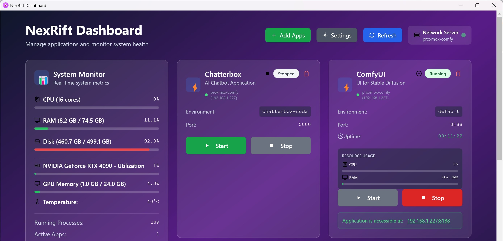

# NexRift

A modern web-based dashboard for managing Python applications across multiple servers. Start, stop, and monitor your applications with a beautiful, responsive interface that supports both web and desktop (Electron) modes.

## ✨ Features

- **🖥️ Multi-Server Support** - Manage applications across multiple servers from one dashboard
- **🎨 Modern Dashboard** - Beautiful, responsive web interface with real-time updates
- **📱 Desktop & Web App** - Available as both Electron desktop app and web interface
- **🔧 Multiple App Types** - Support for conda environments, executables, and batch files
- **⚡ Real-Time Monitoring** - Live system metrics (CPU, RAM, GPU, Disk usage)
- **🚀 App Management** - Add popular apps (ComfyUI, Chatterbox, SwarmUI) with templates
- **🔄 Auto-Refresh** - Automatic dashboard refresh when switching servers
- **⚙️ Server-Specific Configs** - Each server maintains its own app configurations
- **🌐 Network Access** - Access your apps from any device on your network

## 📱 Screenshots



The dashboard provides:
- Multi-server management with automatic hostname detection
- Real-time system resource monitoring (CPU, RAM, GPU, Disk)
- Application status with uptime tracking and resource usage
- Start/Stop/Restart controls for each application
- Settings panel for managing backend servers
- App management with popular app templates

## 🛠️ Installation

### Prerequisites

- **Python 3.8+** installed on your system
- **Node.js** (for Electron desktop app)
- **Git** (optional, for cloning)
- **Windows/Linux/Mac** supported

### Step 1: Clone or Download

```bash
git clone https://github.com/yourusername/nexrift
cd nexrift
```

### Step 2: Install Backend Dependencies

```bash
pip install Flask Flask-CORS psutil
```

### Step 3: Set Up Desktop App (Optional)

```bash
npm install
```

## 🚀 Quick Start

### Option 1: Using Batch Files (Windows - Recommended)

1. **Run the master launcher:**
   ```
   Double-click start_all.bat
   ```

2. **Choose option 3** to start both backend and dashboard

3. **Access your dashboard** at: `http://localhost:8080`

### Option 2: Manual Start

**Backend Server:**
```bash
python app_manager.py
```

**Dashboard Server:**
```bash
cd dashboard
python serve_dashboard.py
```

**Desktop App:**
```bash
npm run dev
```

## 🔧 Server-Specific Configuration

NexRift uses server-specific configurations to ensure each server only shows its own applications.

### Automatic Setup

When you first run `app_manager.py` on a new server:

1. **Server Detection** - Automatically detects hostname
2. **Config Creation** - Creates appropriate `apps_config.json`
3. **Default Apps** - Adds default apps for known servers (like proxmox-comfy)
4. **Clean Start** - Unknown servers start with empty configuration

### Supported App Types

**Python/Conda Apps:**
```json
{
    "my_app": {
        "name": "My Python App",
        "type": "conda",
        "environment": "my-conda-env",
        "path": "app.py",
        "port": 8000,
        "description": "My awesome app",
        "working_dir": "/path/to/app"
    }
}
```

**Executable Apps:**
```json
{
    "comfyui": {
        "name": "ComfyUI",
        "type": "executable", 
        "path": "python_embeded/python.exe",
        "args": ["-s", "ComfyUI/main.py", "--listen"],
        "port": 8188,
        "working_dir": "/path/to/ComfyUI"
    }
}
```

**Batch File Apps:**
```json
{
    "swarmui": {
        "name": "SwarmUI",
        "type": "batch",
        "path": "launch-windows.bat",
        "port": 7801,
        "working_dir": "/path/to/swarmui"
    }
}
```

### Adding Applications

1. Click **Settings** → **Add Apps**
2. Choose from popular templates:
   - ComfyUI (Stable Diffusion UI)
   - Chatterbox (AI Chatbot)
   - SwarmUI (Advanced SD UI)
   - Automatic1111 (Web UI for SD)
   - InvokeAI (SD Toolkit)
3. Configure paths and settings
4. Apps are automatically saved to server's configuration

## 🌐 Multi-Server Management

### Adding Servers

1. **Click Settings gear icon**
2. **Enter server address** (e.g., 192.168.1.227:8000)
3. **Click Save** - Dashboard automatically refreshes from new server
4. **Switch between servers** - Each shows only its own apps

### Server Recognition

- **proxmox-comfy**: Default AI apps (ComfyUI, Chatterbox, SwarmUI)
- **alien/beelink**: Clean start (empty configuration)  
- **Other servers**: Clean start (empty configuration)

## 📡 API Endpoints

The backend provides a comprehensive REST API:

**Core:**
- `GET /api/health` - Server health and hostname info
- `GET /api/system/metrics` - Real-time system metrics

**App Management:**
- `GET /api/apps` - List all applications with server info
- `GET /api/apps/{app_id}` - Get detailed app status
- `POST /api/apps/{app_id}/start` - Start application
- `POST /api/apps/{app_id}/stop` - Stop application
- `POST /api/apps/{app_id}/restart` - Restart application

**Configuration:**
- `GET /api/apps/config` - Get app configurations
- `POST /api/apps/config` - Add new app configuration
- `DELETE /api/apps/config/{app_id}` - Remove app configuration
- `GET /api/apps/templates` - Get popular app templates

## 🔍 Troubleshooting

### Server Connection Issues

**Dashboard shows "Cannot connect to backend server":**
- Ensure backend is running: `python app_manager.py`
- Check server address in settings
- Verify firewall allows connections to port 8000
- Test manually: `curl http://SERVER_IP:8000/api/health`

### App Configuration Issues

**Apps not starting:**
- Check app configuration with test endpoint
- Verify working directory and executable paths exist
- Check conda environment exists: `conda env list`
- Review server logs for detailed error messages

### Multi-Server Issues

**Wrong apps showing on server:**
- Delete `apps_config.json` on affected server
- Restart `app_manager.py` to recreate default config
- Verify hostname detection in server logs

### Migration from Old Setup

Run the migration script on each server:
```bash
python migrate-to-server-configs.py
```

## 🎯 File Structure

```
nexrift/
├── app_manager.py              # Backend server
├── dashboard/
│   ├── dashboard.html          # Main dashboard UI
│   └── serve_dashboard.py      # Dashboard web server
├── src/                        # Electron app source
│   ├── main.js                 # Main Electron process
│   └── preload.js             # Preload script
├── apps_config.json           # Server-specific app configs
├── migrate-to-server-configs.py # Migration script
├── start_all.bat              # Windows launcher
├── start_app_manager.bat      # Backend launcher
├── start_dashboard.bat        # Dashboard launcher
└── README.md                  # This file
```

## 🚀 Deployment

### Single Server Setup

1. Copy `app_manager.py` to target server
2. Install dependencies: `pip install Flask Flask-CORS psutil`
3. Run: `python app_manager.py`
4. Server creates its own `apps_config.json` automatically

### Multi-Server Setup

1. Deploy backend on each server
2. Each server maintains its own app configurations
3. Use dashboard from any location to manage all servers
4. Add/remove servers through dashboard settings

## 🔧 Development

### Running in Development

```bash
# Backend with auto-reload
python app_manager.py

# Dashboard development server
cd dashboard && python serve_dashboard.py

# Electron app development
npm run dev
```

### Building Electron App

```bash
npm run build
```

## 🤝 Contributing

1. Fork the repository
2. Create your feature branch: `git checkout -b feature/amazing-feature`
3. Commit your changes: `git commit -m 'Add amazing feature'`
4. Push to the branch: `git push origin feature/amazing-feature`
5. Open a Pull Request

## 📄 License

This project is open source under the MIT License.

## 🆘 Support

For issues and support:
1. Check the troubleshooting section above
2. Review server logs for detailed error messages
3. Test API endpoints manually with curl
4. Ensure all paths and configurations are correct

---

**Made with ❤️ for seamless multi-server Python app management**